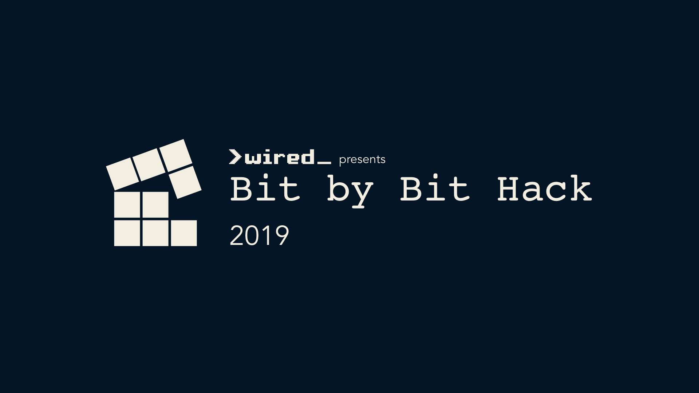

# Bit by Bit Website 2019

This is the website for Bit by Bit Hackathon 2019. 

## [-> Register Now](https://www.eventbrite.com.au/e/bit-by-bit-hackathon-2019-tickets-62415133344)

# Development
## Prerequisites
You will need:
- Node v8 or Newer

## Installation
To install simply run `yarn` or `npm install`

## Development
To develop locally run `yarn start` or `npm run start`

## Deployments
To deploy run `yarn deploy` or `npm run deploy`

# LICENSE
This repo is licensed under `MIT` see [LICENSE](./LICENSE) for more info.
